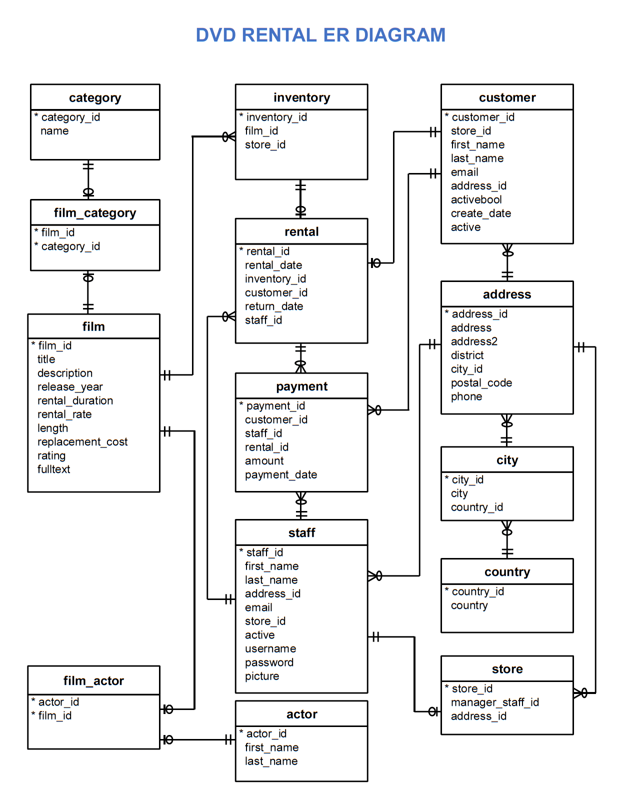

This project used SQL to explore a sample database (Sakila) related to movie rentals.

# Skills
* SQL, PostgresSQL, relational databases.

# Objectives and Tasks
* Database familization.
* Write and run SQL queries to answer interesting questions about the database.
* Build visualizations to illustrate query results.
* Prepare slide deck to summarize findings.

## Database ERD

## References
* Udacity Programming for Data Science with Python curriculum.
* Sakila Sample Database.
